# Architecture Overview
## RegSense Compliance Copilot Platform

---

## 🏛️ High-Level System Architecture

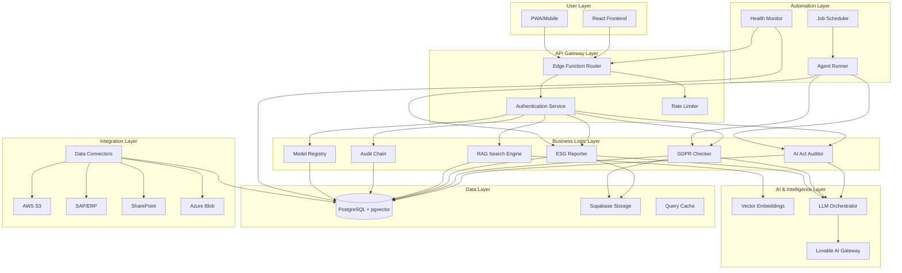

---

## 🔄 End-to-End Request Flow

### Flow 1: AI Act Risk Assessment

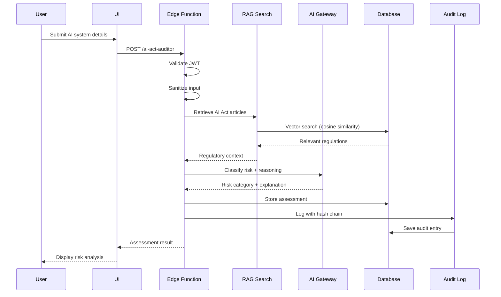

### Flow 2: ESG Data Ingestion & Reporting

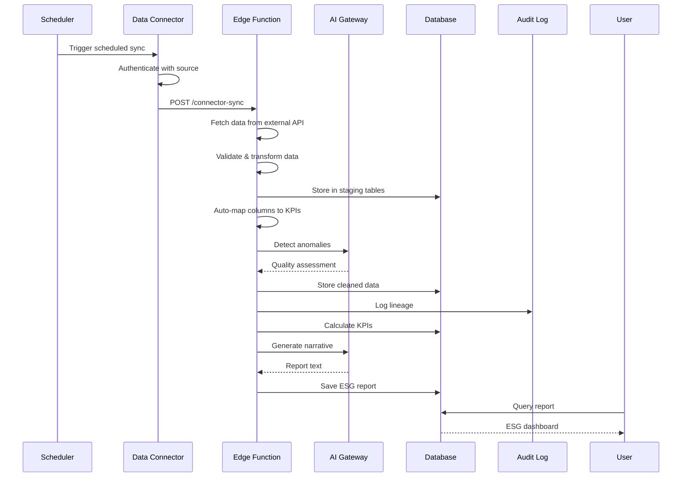

### Flow 3: Agent-Driven Automation

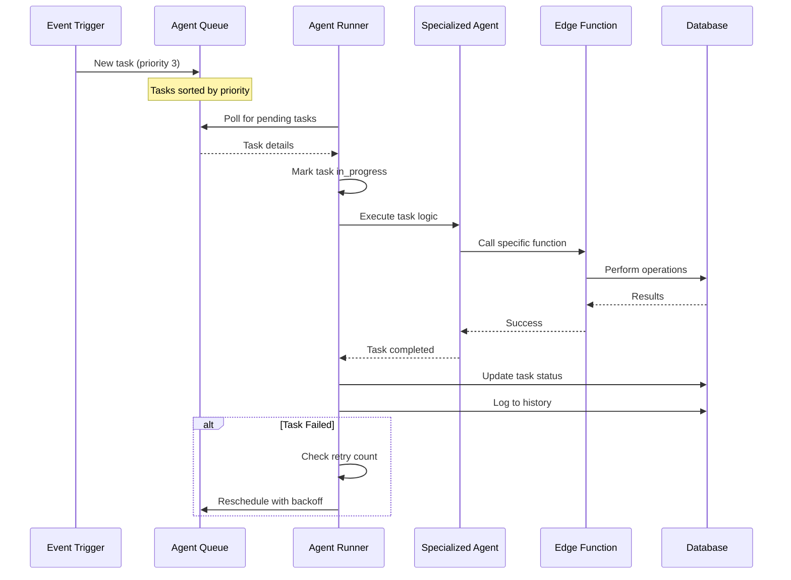

---

## 🧩 Component Architecture

### Frontend Architecture

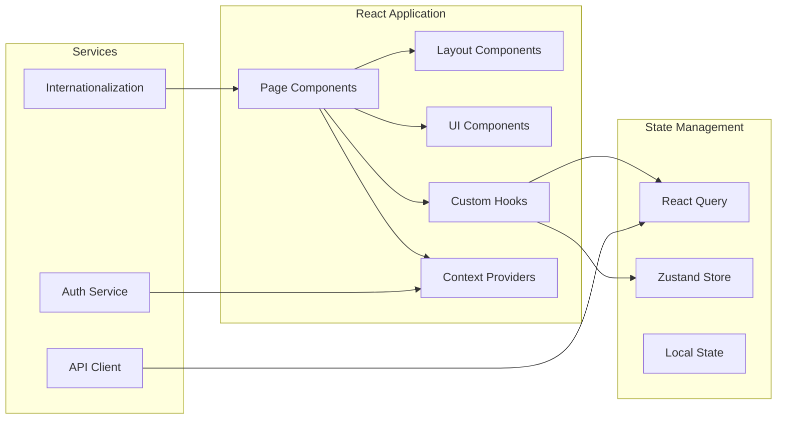

### Backend Architecture

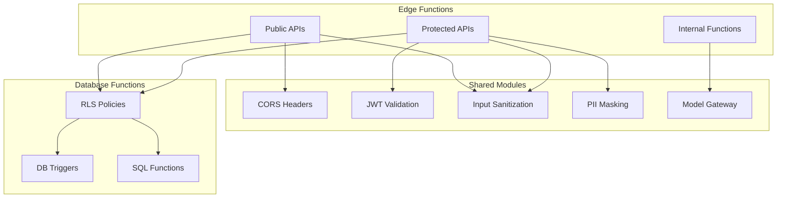

---

## 🔐 Security Architecture

### Authentication & Authorization Flow

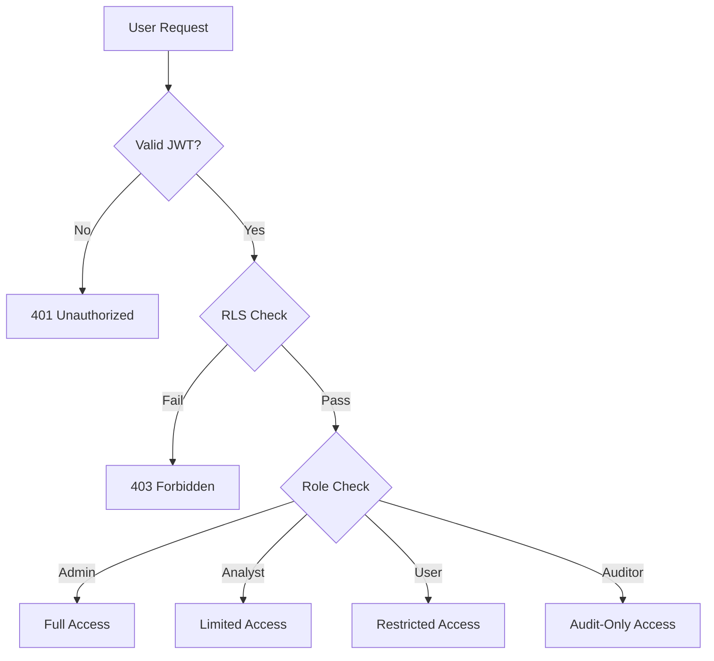

### Data Flow Security

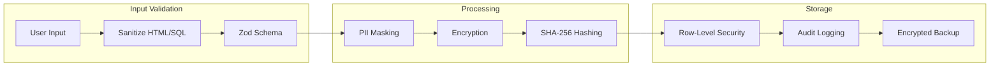

---

## 📊 Data Architecture

### Database Schema Overview

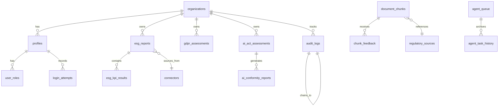

### Storage Structure

```
supabase-storage/
├── avatars/ (public)
│   └── {user_id}/avatar.png
├── gdpr-documents/ (private)
│   └── {org_id}/{document_id}.pdf
├── esg-documents/ (private)
│   └── {org_id}/{year}/{report}.xlsx
├── ai-act-documents/ (private)
│   └── {org_id}/assessments/{id}.pdf
├── regulatory-documents/ (private)
│   └── regulations/{regulation_name}.pdf
└── connector-synced-files/ (private)
    └── {org_id}/{connector_id}/{file}
```

---

## 🚀 Deployment Architecture

### Production Environment

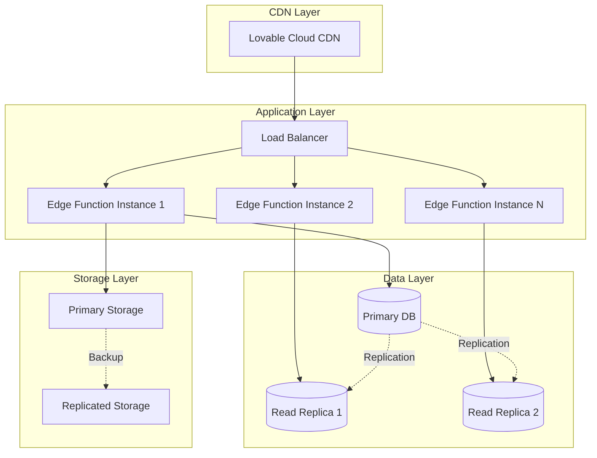

---

## 📈 Monitoring & Observability

### System Health Dashboard

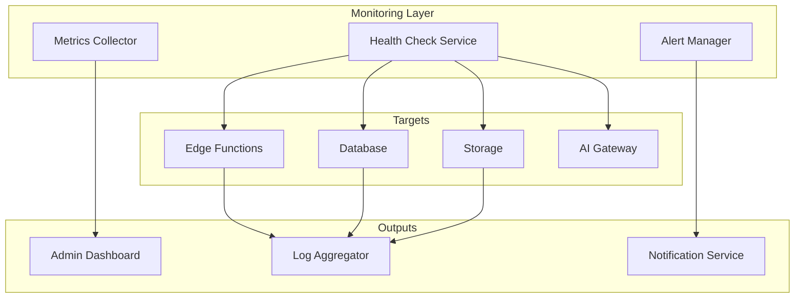

### Performance Metrics

| Metric | Target | Current | Alert Threshold |
|--------|--------|---------|-----------------|
| API Response Time | < 500ms | ~300ms | > 1s |
| Database Query Time | < 100ms | ~50ms | > 500ms |
| AI Gateway Latency | < 2s | ~1.5s | > 5s |
| Uptime | 99.9% | 99.95% | < 99% |
| Error Rate | < 0.1% | 0.05% | > 1% |

---

## 🔧 Technology Stack

### Frontend Stack
- **Framework**: React 18.3.1
- **Build Tool**: Vite
- **Language**: TypeScript 5.x
- **Styling**: Tailwind CSS 3.x + shadcn/ui
- **State**: Zustand + React Query
- **Routing**: React Router v6
- **Charts**: Recharts
- **i18n**: i18next

### Backend Stack
- **Runtime**: Deno (Edge Functions)
- **Database**: PostgreSQL 15+ with pgvector
- **Auth**: Supabase Auth (JWT + RLS)
- **Storage**: Supabase Storage (S3-compatible)
- **AI**: Lovable AI Gateway (Gemini + GPT)
- **Validation**: Zod schemas

### DevOps Stack
- **CI/CD**: GitHub Actions
- **Monitoring**: Supabase Analytics
- **Testing**: Vitest + Playwright
- **Documentation**: Markdown + Mermaid

---

## 📝 Configuration Management

### Environment Variables

```typescript
// Frontend (.env)
VITE_SUPABASE_URL=https://[project].supabase.co
VITE_SUPABASE_PUBLISHABLE_KEY=eyJhbGc...
VITE_SUPABASE_PROJECT_ID=usaygwvfanqlpruyzmhl

// Backend (Supabase Secrets)
SUPABASE_SERVICE_ROLE_KEY=eyJhbGc...
LOVABLE_API_KEY=[auto-generated]
RECAPTCHA_SECRET_KEY=[user-provided]
RECAPTCHA_SITE_KEY=[user-provided]
stripe_payment=[user-provided]
```

### Feature Flags

```typescript
// Module enablement stored in database
organizations {
  enabled_modules: string[] // ['ai_act', 'gdpr', 'esg']
  billing_model: 'byok' | 'pay_as_you_go'
  llm_token_quota: number
  tokens_used_this_month: number
}
```

---

## 🎯 Key Design Principles

1. **Modularity**: Each compliance module operates independently
2. **Security-First**: Authentication, authorization, and audit at every layer
3. **Scalability**: Horizontal scaling via serverless architecture
4. **Auditability**: Complete data lineage with hash-chained logs
5. **Extensibility**: Plugin architecture for new regulations
6. **Resilience**: Automatic retry, fallback, and error recovery
7. **Performance**: Sub-second API responses, optimized queries
8. **Compliance**: GDPR, SOC 2, ISO 27001 aligned

---

## 📚 Related Documentation

- [Module Dependency Graph](./MODULE_DEPENDENCY_GRAPH.md)
- [API Contracts](./API_CONTRACTS.md)
- [Security Documentation](./SECURITY.md)
- [Deployment Guide](./RUNBOOK.md)
