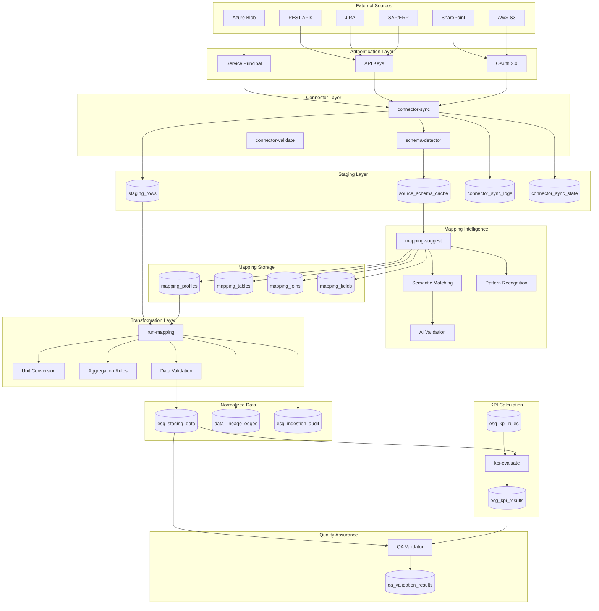
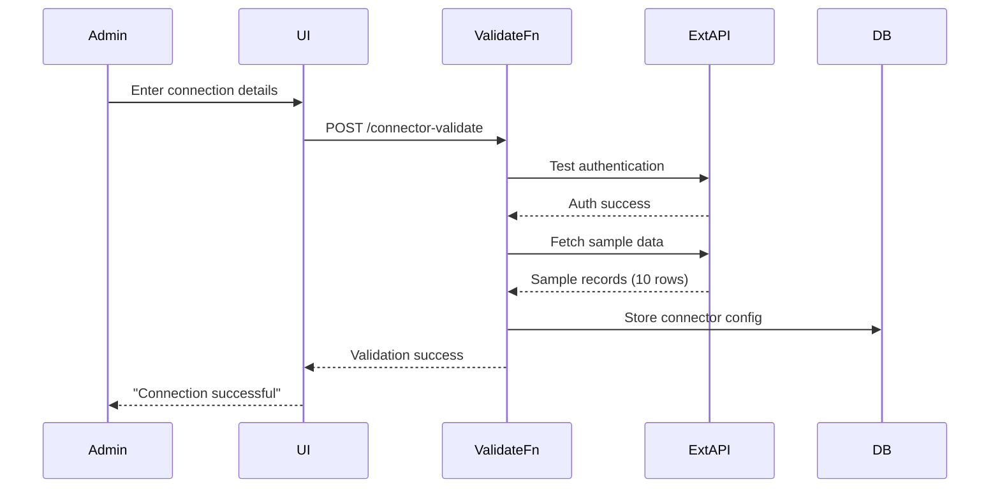
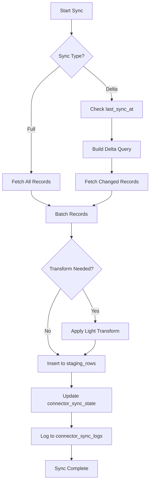
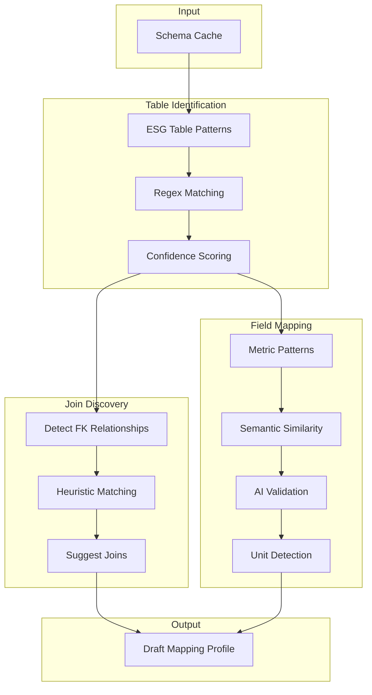
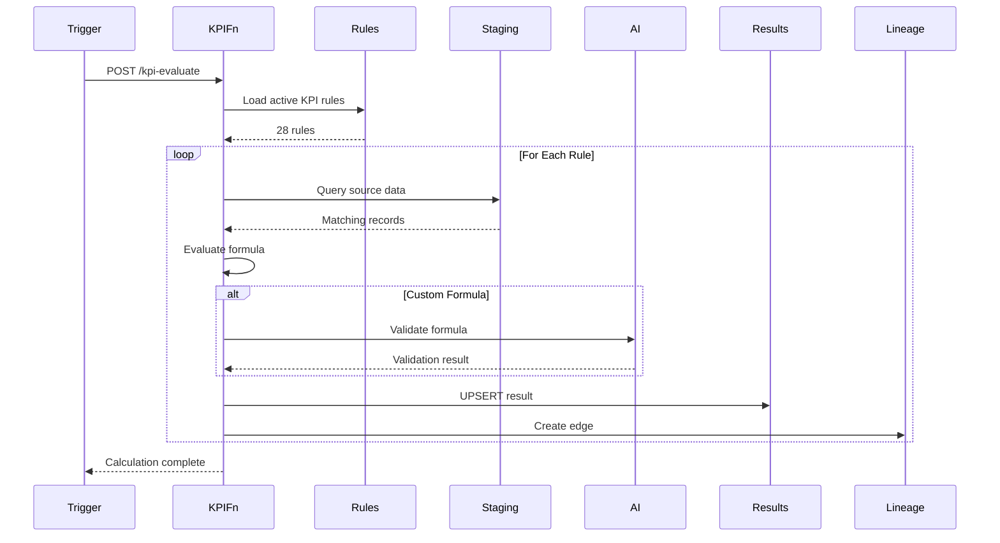

# Data Ingestion & Mapping Flow
## ESG Data Pipeline Architecture

---

## 🔄 Complete Ingestion Pipeline



---

## 📊 Data Flow Stages

### Stage 1: Connection & Authentication



**Supported Authentication Methods:**

| Source | Method | Credentials Required | Token Refresh |
|--------|--------|---------------------|---------------|
| AWS S3 | API Keys | Access Key + Secret | N/A |
| SharePoint | OAuth 2.0 | Client ID + Secret | Auto (60 min) |
| Azure Blob | Service Principal | Tenant ID + Client Secret | Auto (60 min) |
| SAP | Basic Auth | Username + Password | N/A |
| JIRA | API Token | Email + API Token | N/A |
| Custom API | Bearer Token | Token | Manual refresh |

---

### Stage 2: Schema Discovery

```typescript
// Pseudo-code for schema detection
async function detectSchema(connectorId: string) {
  const connection = await getConnectorConfig(connectorId);
  
  // Introspect data source
  const tables = await connection.listTables();
  
  const schemaCache = [];
  
  for (const table of tables) {
    const columns = await connection.describeTable(table.name);
    const sample = await connection.query(`SELECT * FROM ${table.name} LIMIT 10`);
    
    schemaCache.push({
      connector_id: connectorId,
      table_name: table.name,
      schema_name: table.schema,
      columns: columns.map(col => ({
        column_name: col.name,
        data_type: col.type,
        nullable: col.nullable,
        primary_key: col.isPK,
        foreign_keys: col.fkReferences
      })),
      sample_data: sample,
      row_count_estimate: table.rowCount
    });
  }
  
  // Store in database
  await bulkInsert('source_schema_cache', schemaCache);
  
  return schemaCache;
}
```

**Schema Metadata Captured:**

- Table name, schema, database
- Column names, data types, constraints
- Primary keys, foreign keys, indexes
- Sample data (10 rows for inspection)
- Row count estimate
- Last modified timestamp

---

### Stage 3: Data Synchronization



**Delta Load Strategy:**

```sql
-- PostgreSQL query for delta load
WITH last_sync AS (
  SELECT last_sync_at 
  FROM connector_sync_state 
  WHERE connector_id = $1
)
SELECT * 
FROM external_table 
WHERE 
  modified_at > (SELECT last_sync_at FROM last_sync)
  OR created_at > (SELECT last_sync_at FROM last_sync)
ORDER BY modified_at ASC
LIMIT 10000;
```

**Batch Processing:**

- Batch size: 1,000 rows per insert
- Parallel batches: Up to 5 concurrent
- Timeout: 30 seconds per batch
- Retry: 3 attempts with exponential backoff

---

### Stage 4: Intelligent Mapping



**ESG Table Pattern Examples:**

```typescript
const ESG_TABLE_PATTERNS = [
  {
    regex: /^(energy|electricity|power|fuel).*consumption$/i,
    category: 'E1-Energy',
    confidence: 0.9
  },
  {
    regex: /^(ghg|emissions?|carbon|co2).*$/i,
    category: 'E1-GHG',
    confidence: 0.95
  },
  {
    regex: /^(water|h2o).*$/i,
    category: 'E3-Water',
    confidence: 0.9
  },
  {
    regex: /^(waste|disposal|recycling).*$/i,
    category: 'E5-Waste',
    confidence: 0.85
  },
  {
    regex: /^(employee|workforce|staff|personnel).*$/i,
    category: 'S1-Workforce',
    confidence: 0.8
  },
  {
    regex: /^(diversity|gender|minority).*$/i,
    category: 'S1-Diversity',
    confidence: 0.85
  }
];
```

**Metric Mapping Patterns:**

```typescript
const METRIC_MAPPINGS = {
  'E1-1.scope1': {
    patterns: [
      'scope_?1',
      'direct.*emission',
      'stationary.*combustion',
      'mobile.*combustion'
    ],
    unit: 'tCO2e',
    esrs_ref: 'ESRS E1.7',
    transform: 'kg_to_tonnes'
  },
  'E1-2.energy': {
    patterns: [
      'energy.*consumption',
      'kwh.*consumed',
      'electricity.*usage',
      'power.*consumed'
    ],
    unit: 'MWh',
    esrs_ref: 'ESRS E1.8',
    transform: 'kWh_to_MWh'
  },
  'E3-1.water': {
    patterns: [
      'water.*consumption',
      'water.*usage',
      'h2o.*consumed'
    ],
    unit: 'm³',
    esrs_ref: 'ESRS E3.1',
    transform: null
  }
};
```

**Confidence Scoring:**

```typescript
function calculateMappingConfidence(
  columnName: string,
  tableName: string,
  dataType: string,
  metricPattern: Pattern
): number {
  let score = 0;
  
  // Direct name match: +0.4
  if (metricPattern.patterns.some(p => new RegExp(p, 'i').test(columnName))) {
    score += 0.4;
  }
  
  // Table context match: +0.2
  if (metricPattern.patterns.some(p => new RegExp(p, 'i').test(tableName))) {
    score += 0.2;
  }
  
  // Correct data type: +0.2
  if (dataType === 'numeric' || dataType === 'decimal' || dataType === 'float') {
    score += 0.2;
  }
  
  // Unit in column name: +0.2
  if (columnName.includes(metricPattern.unit.toLowerCase())) {
    score += 0.2;
  }
  
  return Math.min(score, 1.0);
}
```

---

### Stage 5: Transformation & Loading

```typescript
// Transformation pipeline
async function runMapping(mappingProfileId: string) {
  const profile = await getMappingProfile(mappingProfileId);
  const fieldMappings = await getFieldMappings(mappingProfileId);
  const sourceData = await getStagingData(profile.connector_ids);
  
  const transformedRecords = [];
  const lineageEdges = [];
  
  for (const row of sourceData) {
    for (const mapping of fieldMappings) {
      let value = row[mapping.source_column];
      
      // Apply transformation
      if (mapping.transform_type) {
        value = await applyTransform(value, mapping.transform_type, mapping.transform_params);
      }
      
      // Validate
      const validation = validateValue(value, mapping.target_metric);
      if (!validation.passed) {
        // Log validation failure
        await logValidationError(row.id, mapping.id, validation.error);
        continue;
      }
      
      // Create normalized record
      transformedRecords.push({
        organization_id: profile.organization_id,
        metric_code: mapping.target_metric,
        value: value,
        unit: mapping.target_unit,
        period: extractPeriod(row),
        source_table: mapping.source_table,
        source_column: mapping.source_column,
        data_quality: validation.quality_score
      });
      
      // Create lineage edge
      lineageEdges.push({
        source_id: row.id,
        source_type: 'staging_row',
        target_id: null, // will be filled after insert
        target_type: 'esg_staging_data',
        transformation: mapping.transform_type,
        confidence: mapping.confidence
      });
    }
  }
  
  // Bulk insert
  const insertedRecords = await bulkInsert('esg_staging_data', transformedRecords);
  
  // Update lineage with target IDs
  for (let i = 0; i < lineageEdges.length; i++) {
    lineageEdges[i].target_id = insertedRecords[i].id;
  }
  await bulkInsert('data_lineage_edges', lineageEdges);
  
  return {
    records_transformed: transformedRecords.length,
    records_inserted: insertedRecords.length
  };
}
```

**Supported Transformations:**

| Transform Type | Description | Example |
|----------------|-------------|---------|
| `unit_conversion` | Convert units | kWh → MWh |
| `aggregation` | Aggregate values | SUM, AVG, MAX |
| `date_extraction` | Extract period | '2024-01-15' → '2024-Q1' |
| `currency_conversion` | Convert currency | USD → EUR |
| `emission_factor` | Apply emission factor | Activity × Factor |
| `normalization` | Normalize to org size | Value / Employee Count |

---

### Stage 6: KPI Calculation



**KPI Formula Examples:**

```json
{
  "metric_code": "E1-1.scope1",
  "formula": {
    "type": "field_sum",
    "source": "esg_staging_data",
    "field": "value",
    "filters": {
      "metric_code": "E1-1.scope1",
      "period": "2024"
    },
    "group_by": ["period"],
    "transform": null
  },
  "unit": "tCO2e",
  "mandatory": true
}
```

```json
{
  "metric_code": "E1-intensity",
  "formula": {
    "type": "ratio",
    "numerator": {
      "metric": "E1-1.scope1"
    },
    "denominator": {
      "metric": "revenue",
      "source": "financial_data"
    }
  },
  "unit": "tCO2e/M€",
  "mandatory": false
}
```

---

### Stage 7: Quality Assurance

```typescript
// QA Validation Rules
const qaRules = [
  {
    name: 'Completeness',
    validator: async (kpiResult) => {
      const sourceData = await getSourceData(kpiResult.id);
      const nullCount = sourceData.filter(r => r.value === null).length;
      const completeness = 1 - (nullCount / sourceData.length);
      
      return {
        passed: completeness >= 0.9,
        score: completeness,
        severity: completeness < 0.9 ? 'high' : 'low',
        message: `Data completeness: ${(completeness * 100).toFixed(1)}%`
      };
    }
  },
  {
    name: 'Consistency',
    validator: async (kpiResult) => {
      const previousPeriod = await getPreviousPeriodKPI(kpiResult);
      if (!previousPeriod) return { passed: true, severity: 'info', message: 'No historical data' };
      
      const change = Math.abs((kpiResult.value - previousPeriod.value) / previousPeriod.value);
      
      return {
        passed: change < 0.5,
        score: 1 - change,
        severity: change > 0.5 ? 'medium' : 'low',
        message: `Year-over-year change: ${(change * 100).toFixed(1)}%`
      };
    }
  },
  {
    name: 'Plausibility',
    validator: async (kpiResult) => {
      const industryBenchmark = await getIndustryBenchmark(kpiResult.metric_code);
      if (!industryBenchmark) return { passed: true, severity: 'info', message: 'No benchmark available' };
      
      const deviation = kpiResult.value / industryBenchmark.median;
      
      return {
        passed: deviation < 3,
        score: 1 / deviation,
        severity: deviation > 3 ? 'medium' : 'low',
        message: `${deviation.toFixed(1)}x industry median`
      };
    }
  }
];
```

---

## 🛠️ Configuration & Customization

### Custom Transformation Functions

Admins can define custom transformations:

```typescript
// Custom transform registry
const customTransforms = {
  'natural_gas_to_co2': (value, params) => {
    const emissionFactor = params.emission_factor || 0.203; // tCO2e/MWh
    return value * emissionFactor;
  },
  
  'headcount_normalization': async (value, params) => {
    const headcount = await getOrganizationHeadcount(params.org_id, params.period);
    return value / headcount;
  }
};
```

### Custom KPI Rules

Users can define organization-specific KPIs:

```json
{
  "metric_code": "CUSTOM-1.employee-training",
  "metric_name": "Average Training Hours per Employee",
  "formula": {
    "type": "custom",
    "sql": "SELECT AVG(training_hours) FROM esg_staging_data WHERE metric_code = 'S1-training' AND period = $1"
  },
  "unit": "hours",
  "category": "S1-Workforce",
  "mandatory": false,
  "custom": true
}
```

---

## 📊 Performance Optimization

### Indexing Strategy

```sql
-- Critical indexes for performance
CREATE INDEX idx_staging_connector_period 
ON staging_rows(connector_id, ingested_at);

CREATE INDEX idx_esg_staging_metric_period 
ON esg_staging_data(metric_code, period);

CREATE INDEX idx_lineage_source 
ON data_lineage_edges(source_id, source_type);

CREATE INDEX idx_kpi_results_org_period 
ON esg_kpi_results(organization_id, period);
```

### Batch Processing

- **Staging Inserts**: 1,000 rows per batch
- **Transformation**: 5,000 rows per batch
- **KPI Calculation**: Process all periods in single query
- **Parallel Processing**: Up to 5 concurrent mapping jobs

### Caching Strategy

```typescript
// Cache mapping profiles for 1 hour
const mappingCache = new Map();

async function getCachedMappingProfile(profileId: string) {
  if (mappingCache.has(profileId)) {
    const cached = mappingCache.get(profileId);
    if (Date.now() - cached.timestamp < 3600000) {
      return cached.data;
    }
  }
  
  const profile = await db.query('SELECT * FROM mapping_profiles WHERE id = $1', [profileId]);
  mappingCache.set(profileId, { data: profile, timestamp: Date.now() });
  return profile;
}
```

---

## 🔐 Security & Access Control

### RLS Policies on Staging Tables

```sql
-- staging_rows
CREATE POLICY "Users can only access their org's staging data"
ON staging_rows FOR SELECT
USING (
  connector_id IN (
    SELECT id FROM connectors 
    WHERE organization_id = (SELECT organization_id FROM profiles WHERE id = auth.uid())
  )
);

-- esg_staging_data
CREATE POLICY "Users can only access their org's ESG data"
ON esg_staging_data FOR SELECT
USING (organization_id = (SELECT organization_id FROM profiles WHERE id = auth.uid()));
```

### Data Masking

```typescript
// Mask sensitive fields during staging
const sensitivePatterns = [
  /ssn/i,
  /social.*security/i,
  /tax.*id/i,
  /passport/i
];

function maskValue(columnName: string, value: any): any {
  if (sensitivePatterns.some(p => p.test(columnName))) {
    return '***REDACTED***';
  }
  return value;
}
```

---

## 📝 Related Documentation

- [Architecture Overview](./ARCHITECTURE_OVERVIEW.md)
- [Module Dependency Graph](./MODULE_DEPENDENCY_GRAPH.md)
- [Sequence Flow: ESG Validation](./SEQUENCE_FLOW_ESG_VALIDATION.md)
- [API Contracts](./API_CONTRACTS.md)
