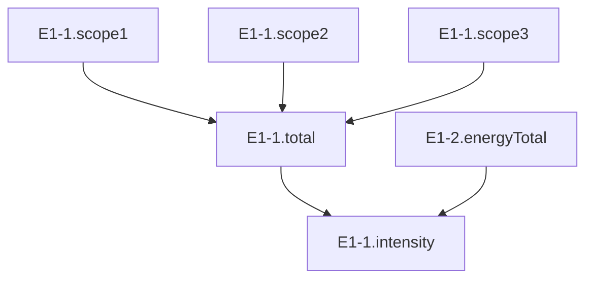

# ESG KPI Rules & Formula Language

## Overview

KPI rules define how to calculate standardized ESRS metrics from mapped source data. Each rule is stored as JSON and evaluated deterministically by the `kpi-evaluate` engine.

## KPI Rule Structure

```json
{
  "id": "uuid",
  "organization_id": "org-uuid",
  "metric_code": "E1-1.total",
  "formula": {
    "type": "sum",
    "fields": ["E1-1.scope1", "E1-1.scope2", "E1-1.scope3"]
  },
  "unit": "tonnes CO2e",
  "esrs_ref": "ESRS E1 Climate Change",
  "version": 1,
  "active": true,
  "description": "Total GHG emissions across all scopes",
  "created_at": "2024-01-01T00:00:00Z",
  "updated_at": "2024-01-01T00:00:00Z"
}
```

## Formula Types

### 1. Field Sum
Directly uses a pre-aggregated field from mapping results.

```json
{
  "type": "field_sum",
  "field": "E1-1.scope1"
}
```

**Use Case:** When mapping already produced the correct aggregation.

**Example:**
```sql
-- Mapping produced:
E1-1.scope1 | 2024-Q1 | 1250.5 tonnes

-- KPI rule just references it:
formula: {"type": "field_sum", "field": "E1-1.scope1"}

-- Result:
E1-1.scope1 | 2024-Q1 | 1250.5 tonnes
```

---

### 2. Sum Multiple Fields
Adds multiple metrics together.

```json
{
  "type": "sum",
  "fields": ["E1-1.scope1", "E1-1.scope2", "E1-1.scope3"]
}
```

**Use Case:** Calculate totals across categories.

**Example:**
```sql
-- Input metrics:
E1-1.scope1 | 2024-Q1 | 1200 tonnes
E1-1.scope2 | 2024-Q1 | 800 tonnes
E1-1.scope3 | 2024-Q1 | 2000 tonnes

-- Formula:
{"type": "sum", "fields": ["E1-1.scope1", "E1-1.scope2", "E1-1.scope3"]}

-- Result:
E1-1.total | 2024-Q1 | 4000 tonnes
```

**Period Handling:**
- If periods don't align perfectly, sums are computed per available period
- Missing values treated as 0

---

### 3. Ratio (Division)
Divides one metric by another.

```json
{
  "type": "ratio",
  "numerator": "E1-1.total",
  "denominator": "E1-2.energyTotal",
  "multiply_by": 1000
}
```

**Use Case:** Intensity metrics, efficiency ratios.

**Example:**
```sql
-- Input metrics:
E1-1.total | 2024-Q1 | 4000 tonnes CO2e
E1-2.energyTotal | 2024-Q1 | 50000 MWh

-- Formula:
{
  "type": "ratio",
  "numerator": "E1-1.total",
  "denominator": "E1-2.energyTotal",
  "multiply_by": 1000
}

-- Result:
E1-1.intensity | 2024-Q1 | 80 kg CO2e/MWh
```

**Safety:**
- Division by zero returns 0 (not error)
- Configurable behavior via `on_zero: "null" | "zero" | "skip"`

---

### 4. Weighted Average
Calculates average weighted by another field.

```json
{
  "type": "weighted_avg",
  "value_field": "energy_intensity",
  "weight_field": "production_volume"
}
```

**Use Case:** Average intensity across facilities weighted by production.

**Example:**
```sql
-- Input data:
Site A | intensity: 80 kg/unit | volume: 10000 units
Site B | intensity: 120 kg/unit | volume: 5000 units

-- Formula:
{"type": "weighted_avg", "value_field": "intensity", "weight_field": "volume"}

-- Result:
(80 * 10000 + 120 * 5000) / (10000 + 5000) = 93.33 kg/unit
```

---

### 5. Conditional (If-Then-Else)
Apply different logic based on conditions.

```json
{
  "type": "conditional",
  "conditions": [
    {
      "if": {"field": "country", "equals": "DE"},
      "then": {"multiply_field": "energy_kwh", "by": 0.485}
    },
    {
      "if": {"field": "country", "equals": "FR"},
      "then": {"multiply_field": "energy_kwh", "by": 0.056}
    }
  ],
  "default": {"multiply_field": "energy_kwh", "by": 0.5}
}
```

**Use Case:** Country-specific emission factors, tiered calculations.

---

### 6. Time Series Operations
Aggregate across time windows.

```json
{
  "type": "rolling_sum",
  "field": "E1-1.scope1",
  "window": "12 months",
  "min_periods": 11
}
```

**Supported Operations:**
- `rolling_sum` - Sum over trailing window
- `rolling_avg` - Average over trailing window
- `year_over_year_change` - Compare to same period last year
- `cumulative_sum` - Running total for fiscal year

---

### 7. Complex Formula (Custom JS)
For advanced logic beyond standard operators.

```json
{
  "type": "custom",
  "expression": "(scope1 + scope2) * (1 - renewable_pct/100)"
}
```

**Security Note:** Custom expressions are sandboxed and validated before execution.

---

## ESRS Standard Metrics

### E1: Climate Change

#### Emissions
```json
[
  {
    "metric_code": "E1-1.scope1",
    "description": "Direct GHG emissions (Scope 1)",
    "unit": "tonnes CO2e",
    "formula": {"type": "field_sum", "field": "scope1_emissions"}
  },
  {
    "metric_code": "E1-1.scope2",
    "description": "Indirect GHG emissions from energy (Scope 2)",
    "unit": "tonnes CO2e",
    "formula": {"type": "field_sum", "field": "scope2_emissions"}
  },
  {
    "metric_code": "E1-1.scope3",
    "description": "Other indirect GHG emissions (Scope 3)",
    "unit": "tonnes CO2e",
    "formula": {"type": "field_sum", "field": "scope3_emissions"}
  },
  {
    "metric_code": "E1-1.total",
    "description": "Total GHG emissions",
    "unit": "tonnes CO2e",
    "formula": {
      "type": "sum",
      "fields": ["E1-1.scope1", "E1-1.scope2", "E1-1.scope3"]
    }
  }
]
```

#### Energy
```json
[
  {
    "metric_code": "E1-2.energyTotal",
    "description": "Total energy consumption",
    "unit": "MWh",
    "formula": {"type": "field_sum", "field": "energy_consumption"}
  },
  {
    "metric_code": "E1-2.renewableEnergy",
    "description": "Renewable energy consumption",
    "unit": "MWh",
    "formula": {"type": "field_sum", "field": "renewable_energy"}
  },
  {
    "metric_code": "E1-2.renewablePercent",
    "description": "Renewable energy percentage",
    "unit": "%",
    "formula": {
      "type": "ratio",
      "numerator": "E1-2.renewableEnergy",
      "denominator": "E1-2.energyTotal",
      "multiply_by": 100
    }
  }
]
```

### S1: Own Workforce

#### Headcount
```json
[
  {
    "metric_code": "S1-1.totalEmployees",
    "description": "Total number of employees",
    "unit": "count",
    "formula": {"type": "field_sum", "field": "employee_count"}
  },
  {
    "metric_code": "S1-1.femaleEmployees",
    "description": "Number of female employees",
    "unit": "count",
    "formula": {"type": "field_sum", "field": "female_count"}
  },
  {
    "metric_code": "S1-1.genderRatio",
    "description": "Gender ratio (female %)",
    "unit": "%",
    "formula": {
      "type": "ratio",
      "numerator": "S1-1.femaleEmployees",
      "denominator": "S1-1.totalEmployees",
      "multiply_by": 100
    }
  }
]
```

#### Safety
```json
[
  {
    "metric_code": "S1-2.workplaceIncidents",
    "description": "Number of workplace incidents",
    "unit": "count",
    "formula": {"type": "field_sum", "field": "incident_count"}
  },
  {
    "metric_code": "S1-2.incidentRate",
    "description": "Incident rate per 1000 employees",
    "unit": "per 1000",
    "formula": {
      "type": "ratio",
      "numerator": "S1-2.workplaceIncidents",
      "denominator": "S1-1.totalEmployees",
      "multiply_by": 1000
    }
  }
]
```

### G1: Governance

```json
[
  {
    "metric_code": "G1-1.boardIndependence",
    "description": "Percentage of independent board members",
    "unit": "%",
    "formula": {
      "type": "ratio",
      "numerator": "independent_directors",
      "denominator": "total_directors",
      "multiply_by": 100
    }
  }
]
```

---

## Evaluation Engine

### Execution Order
KPI rules are evaluated in dependency order:



**Algorithm:**
1. Build dependency graph from all active rules
2. Topologically sort (detect circular dependencies)
3. Evaluate in order, caching intermediate results
4. Store final results in `esg_kpi_results`

### Period Alignment
When combining metrics with different periods:

**Scenario 1: Same granularity**
```
E1-1.scope1: [2024-01, 2024-02, 2024-03]
E1-1.scope2: [2024-01, 2024-02, 2024-03]
→ Sum per matching period
```

**Scenario 2: Different granularity**
```
E1-1.scope1: [2024-Q1, 2024-Q2]
E1-2.energyTotal: [2024-01, 2024-02, 2024-03, ...]
→ Aggregate monthly to quarterly first, then compute
```

**Scenario 3: Missing periods**
```
E1-1.scope1: [2024-01, 2024-03]  (missing Feb)
E1-1.scope2: [2024-01, 2024-02, 2024-03]
→ Sum only for common periods, flag missing data
```

---

## Rule Versioning

### Version Management
```sql
-- Create new version of a rule
INSERT INTO esg_kpi_rules (
  organization_id,
  metric_code,
  formula,
  version,
  active
) VALUES (
  'org-uuid',
  'E1-1.total',
  '{"type": "sum", "fields": ["E1-1.scope1", "E1-1.scope2", "E1-1.scope3", "E1-1.biogenic"]}',
  2,  -- New version
  true
);

-- Deactivate old version
UPDATE esg_kpi_rules
SET active = false
WHERE metric_code = 'E1-1.total'
  AND version = 1;
```

### Audit Trail
All rule executions logged:
```json
{
  "rule_id": "rule-uuid",
  "rule_version": 2,
  "metric_code": "E1-1.total",
  "periods_evaluated": ["2024-01", "2024-02", "2024-03"],
  "input_metrics": {
    "E1-1.scope1": [1200, 1150, 1300],
    "E1-1.scope2": [800, 850, 780],
    "E1-1.scope3": [2000, 2100, 1950]
  },
  "output_values": [4000, 4100, 4030],
  "evaluated_at": "2024-04-01T10:30:00Z"
}
```

---

## Testing KPI Rules

### Unit Test Template
```typescript
// Test: E1-1.total = scope1 + scope2 + scope3
const inputs = {
  "E1-1.scope1": new Map([["2024-Q1", 1200]]),
  "E1-1.scope2": new Map([["2024-Q1", 800]]),
  "E1-1.scope3": new Map([["2024-Q1", 2000]])
};

const formula = {
  type: "sum",
  fields: ["E1-1.scope1", "E1-1.scope2", "E1-1.scope3"]
};

const result = await evaluateFormula(formula, inputs);

assert(result.get("2024-Q1") === 4000);
```

### Integration Test
```bash
# Seed test data
POST /functions/v1/demo-seed-ingestion

# Run mapping
POST /functions/v1/run-mapping
{"profile_id": "test-profile"}

# Evaluate KPIs
POST /functions/v1/kpi-evaluate

# Verify results
SELECT metric_code, period, value, unit
FROM esg_kpi_results
WHERE organization_id = 'test-org'
  AND metric_code IN ('E1-1.scope1', 'E1-1.scope2', 'E1-1.scope3', 'E1-1.total')
ORDER BY metric_code, period;
```

Expected output:
```
E1-1.scope1  | 2024-Q1 | 1250.5  | tonnes CO2e
E1-1.scope2  | 2024-Q1 | 847.2   | tonnes CO2e
E1-1.scope3  | 2024-Q1 | 2103.8  | tonnes CO2e
E1-1.total   | 2024-Q1 | 4201.5  | tonnes CO2e
```

---

## Best Practices

1. **Use Standard Types First** - Leverage built-in formula types before custom expressions
2. **Document Business Logic** - Add clear descriptions explaining calculation rationale
3. **Version Carefully** - Only increment version when formula logic changes, not metadata
4. **Test with Edge Cases** - Zero values, missing periods, extreme ranges
5. **Maintain Lineage** - KPI results automatically track which rules produced them
6. **Validate Units** - Ensure formula inputs have compatible units
7. **Handle Nulls Explicitly** - Define behavior for missing data

---

## Troubleshooting

### Issue: KPI returns 0 unexpectedly
**Check:**
- Input metrics exist for that period
- Field names match exactly (case-sensitive)
- Units are compatible

**Debug Query:**
```sql
SELECT metric_code, period, value
FROM esg_kpi_results
WHERE metric_code IN ('E1-1.scope1', 'E1-1.scope2', 'E1-1.scope3')
  AND period = '2024-Q1';
```

### Issue: Circular dependency error
**Cause:** Rule A depends on Rule B, which depends on Rule A
**Solution:** Redesign formula to break cycle, or split into multiple rules

### Issue: Period mismatch in ratio
**Cause:** Numerator and denominator have different time granularity
**Solution:** Aggregate to common granularity first using helper rule

---

## Next Steps

1. Add visual formula builder in UI
2. Implement formula validation API
3. Create rule templates for common patterns
4. Add what-if scenario testing
5. Implement rule impact analysis (which reports use this rule)
