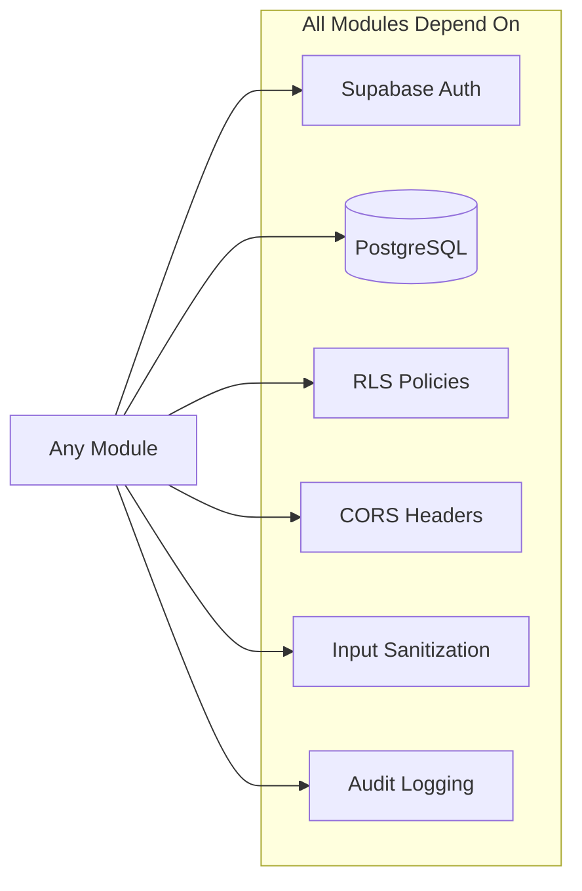
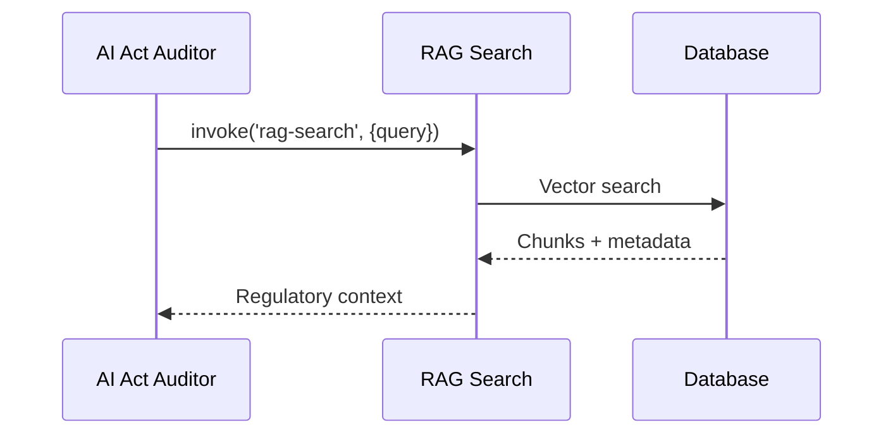
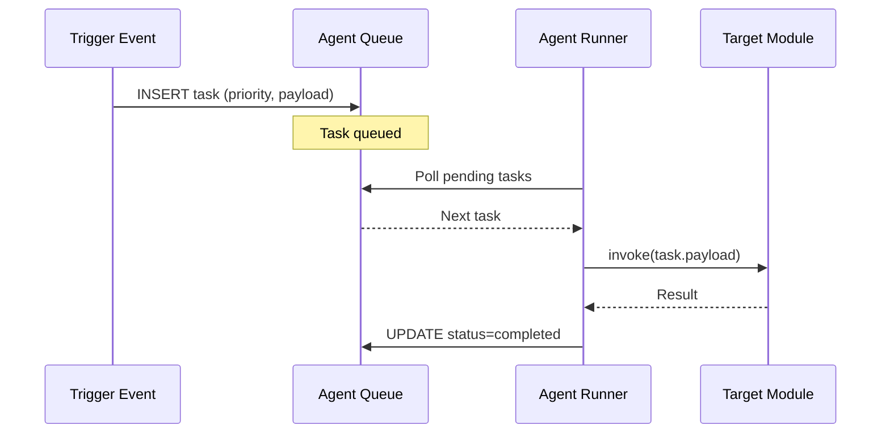
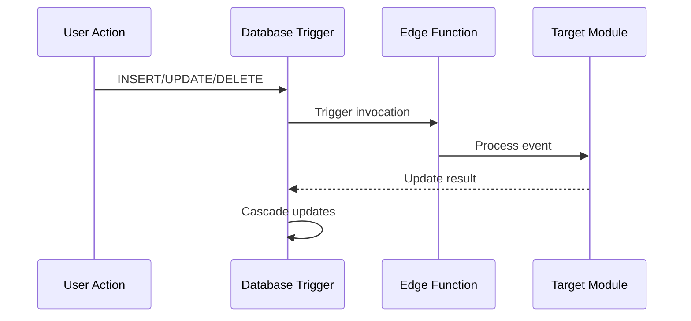
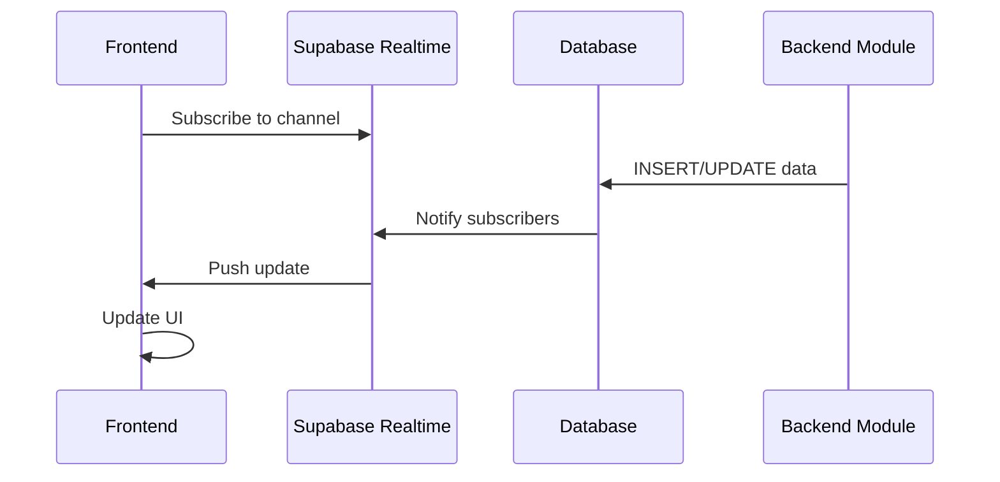
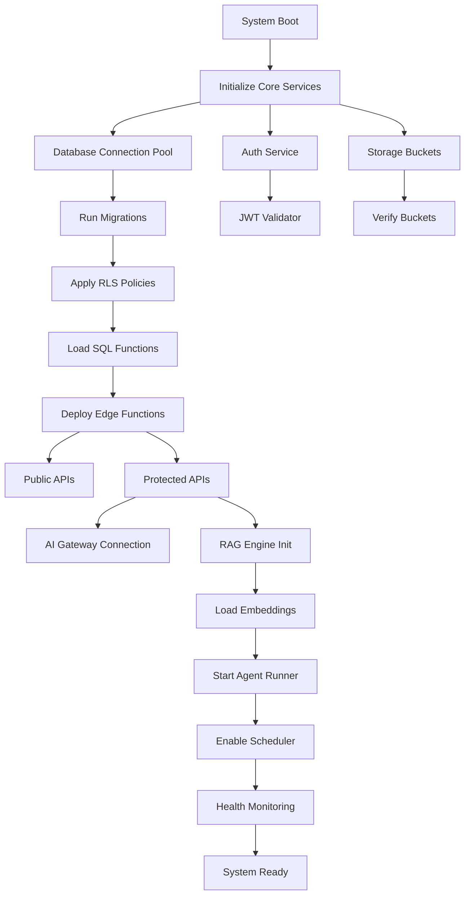

# Module Dependency Graph
## RegSense Compliance Copilot Platform

---

## 🗺️ Complete Module Dependency Map

```mermaid
graph TB
    subgraph "Core Modules"
        AIAct[AI Act Auditor]
        GDPR[GDPR Checker]
        ESG[ESG Reporter]
        DMA[DMA Assessor]
        DORA[DORA Assessor]
        NIS2[NIS2 Assessor]
    end
    
    subgraph "Intelligence Layer"
        RAG[RAG Search Engine]
        AIGateway[AI Gateway / LLM]
        HelpAssist[Help Assistant]
        RegSense[RegSense Query]
    end
    
    subgraph "Data Management"
        Connectors[Data Connectors]
        ESGIngest[ESG Ingestion]
        Mapping[Mapping Engine]
        KPIEval[KPI Evaluator]
        DataLineage[Data Lineage]
    end
    
    subgraph "Governance & Audit"
        AuditChain[Audit Chain]
        ModelReg[Model Registry]
        ExplainAI[Explainability]
        Conformity[Conformity Reports]
    end
    
    subgraph "Automation"
        AgentRunner[Agent Runner]
        Scheduler[Job Scheduler]
        ActuatorAgent[Actuator Agent]
        MonitorAgent[Monitoring Agent]
    end
    
    subgraph "Workflow Management"
        DSARWorkflow[DSAR Workflow]
        DSARQueue[DSAR Queue]
        PIIRedactor[PII Redactor]
        FeedbackHandler[Feedback Handler]
    end
    
    subgraph "Analytics & Reporting"
        ComplianceScore[Compliance Score]
        Intelligence[Continuous Intelligence]
        FeedbackAnalytics[Feedback Analytics]
        LLMAnalytics[LLM Analytics]
    end
    
    AIAct --> RAG
    AIAct --> AIGateway
    AIAct --> AuditChain
    AIAct --> ModelReg
    AIAct --> ExplainAI
    AIAct --> Conformity
    
    GDPR --> RAG
    GDPR --> AIGateway
    GDPR --> AuditChain
    GDPR --> PIIRedactor
    GDPR --> DSARWorkflow
    
    ESG --> Connectors
    ESG --> ESGIngest
    ESG --> Mapping
    ESG --> KPIEval
    ESG --> AIGateway
    ESG --> AuditChain
    ESG --> DataLineage
    
    DMA --> RAG
    DMA --> AIGateway
    DMA --> AuditChain
    
    DORA --> RAG
    DORA --> AIGateway
    DORA --> AuditChain
    
    NIS2 --> RAG
    NIS2 --> AIGateway
    NIS2 --> AuditChain
    
    RAG --> AIGateway
    HelpAssist --> RAG
    HelpAssist --> AIGateway
    RegSense --> RAG
    RegSense --> AIGateway
    
    ESGIngest --> Mapping
    Mapping --> KPIEval
    KPIEval --> DataLineage
    
    AgentRunner --> AIAct
    AgentRunner --> GDPR
    AgentRunner --> ESG
    AgentRunner --> ActuatorAgent
    Scheduler --> AgentRunner
    MonitorAgent --> Scheduler
    
    DSARWorkflow --> PIIRedactor
    DSARWorkflow --> AuditChain
    DSARQueue --> DSARWorkflow
    
    ComplianceScore --> AIAct
    ComplianceScore --> GDPR
    ComplianceScore --> ESG
    ComplianceScore --> DMA
    ComplianceScore --> DORA
    ComplianceScore --> NIS2
    
    Intelligence --> ComplianceScore
    Intelligence --> FeedbackAnalytics
    Intelligence --> LLMAnalytics
    
    FeedbackHandler --> RAG
    FeedbackAnalytics --> FeedbackHandler
```



---

## 🔗 Module Dependency Matrix

| Module | Depends On | Consumed By | Priority | Status |
|--------|-----------|-------------|----------|--------|
| **RAG Search Engine** | document_chunks, embeddings | All compliance modules | Critical | ✅ Active |
| **AI Gateway** | LOVABLE_API_KEY | All LLM consumers | Critical | ✅ Active |
| **Audit Chain** | audit_logs, SHA-256 hashing | All modules | Critical | ✅ Active |
| **AI Act Auditor** | RAG, AI Gateway, Audit Chain | Compliance Score, Reports | High | ✅ Active |
| **GDPR Checker** | RAG, AI Gateway, PII Redactor | DSAR, Compliance Score | High | ✅ Active |
| **ESG Reporter** | Connectors, Mapping, KPI Eval | Intelligence, Reports | High | ✅ Active |
| **Data Connectors** | OAuth tokens, API keys | ESG Ingestion | High | ✅ Active |
| **Model Registry** | model_catalog, usage_logs | AI Act, LLM Analytics | Medium | ✅ Active |
| **Agent Runner** | agent_queue, all modules | Automation | Medium | ✅ Active |
| **DSAR Workflow** | PII Redactor, Audit Chain | GDPR Queue | Medium | ✅ Active |
| **KPI Evaluator** | esg_kpi_rules, mappings | ESG Reporter, Analytics | Medium | ⚠️ Pending migration |
| **Data Lineage** | lineage_edges, source_refs | Explainability, Audit | Medium | ⚠️ Pending migration |
| **Feedback Handler** | chunk_feedback, RAG | Analytics, RAG improvement | Low | ✅ Active |
| **Help Assistant** | help_articles, RAG | User support | Low | ✅ Active |

---

## 📦 Shared Dependencies

### Common Infrastructure



### Shared Utility Functions

| Function | Location | Purpose | Used By |
|----------|----------|---------|---------|
| `corsHeaders` | `_shared/cors.ts` | CORS handling | All edge functions |
| `sanitize()` | `_shared/sanitize.ts` | Input cleaning | All public APIs |
| `maskPII()` | `_shared/pii-masking.ts` | Privacy protection | GDPR, DSAR, Audit |
| `hashData()` | Multiple | SHA-256 hashing | Audit Chain, Reports |
| `modelGateway()` | `_shared/model-gateway.ts` | LLM routing | AI Gateway consumers |
| `getUserFromRequest()` | Multiple | JWT validation | Protected endpoints |

---

## 🔄 Cross-Module Communication Patterns

### Pattern 1: Direct Invocation



**Modules Using This Pattern:**
- AI Act → RAG Search
- GDPR → RAG Search
- ESG → AI Gateway
- All modules → Audit Chain

### Pattern 2: Queue-Based Async



**Modules Using This Pattern:**
- Scheduled Jobs → ESG Sync
- File Upload → GDPR Scan
- Monitoring → Health Check
- Batch Processing → KPI Evaluation

### Pattern 3: Event-Driven Triggers



**Modules Using This Pattern:**
- File Upload → Auto-queue analysis
- Conformity Report → Generate hash
- Connector Sync → Queue mapping
- Agent Task → Archive to history

### Pattern 4: Real-Time Streaming



**Modules Using This Pattern:**
- Audit Logs → Real-time audit view
- DSAR Queue → Live queue updates
- System Health → Status indicators
- Notifications → Alert center

---

## 🎯 Critical Path Analysis

### High-Priority Dependencies (System Cannot Function Without)

1. **Supabase Auth** → All modules
2. **Database (PostgreSQL)** → All modules
3. **RLS Policies** → All data access
4. **AI Gateway** → AI Act, GDPR, ESG, DMA, DORA, NIS2
5. **Audit Chain** → Compliance, Trust, Security

### Medium-Priority Dependencies (Degraded Performance)

1. **RAG Search** → Compliance modules fall back to basic rules
2. **Connectors** → ESG requires manual upload
3. **Agent Runner** → Automation disabled, manual triggers
4. **Model Registry** → AI Act limited functionality

### Low-Priority Dependencies (Nice-to-Have)

1. **Feedback Handler** → RAG continues without feedback
2. **Help Assistant** → Users access static docs
3. **Analytics** → Reporting delayed but functional

---

## 🔧 Module Startup Sequence



**Estimated Boot Time:** ~30 seconds  
**Critical Path:** Database → RLS → Edge Functions → AI Gateway

---

## 🚨 Failure Impact Analysis

### If RAG Search Fails

| Affected Module | Impact | Mitigation |
|----------------|--------|------------|
| AI Act Auditor | Falls back to rule-based classification | Manual review required |
| GDPR Checker | Basic pattern matching only | Reduced accuracy |
| RegSense | Service unavailable | Display cached responses |
| Help Assistant | Static articles only | No semantic search |

### If AI Gateway Fails

| Affected Module | Impact | Mitigation |
|----------------|--------|------------|
| AI Act Auditor | Cannot generate reasoning | Queue for retry |
| GDPR Checker | PII detection limited | Conservative flagging |
| ESG Reporter | No narrative generation | Template-based text |
| All LLM features | Degraded or unavailable | User notification |

### If Database Fails

| Affected Module | Impact | Mitigation |
|----------------|--------|------------|
| All modules | Complete system outage | Fail to read replica |
| Audit logs | Cannot record events | Buffer to memory, flush on restore |
| User sessions | Login failures | Session recovery from JWT |

---

## 📊 Module Integration Testing

### Test Coverage Matrix

| Integration Path | Test Type | Coverage | Status |
|-----------------|-----------|----------|--------|
| UI → AI Act → RAG → AI | E2E | 95% | ✅ Passing |
| UI → GDPR → PII → Audit | E2E | 92% | ✅ Passing |
| Connector → ESG → Mapping → KPI | Integration | 0% | ⚠️ Pending migration |
| Agent → Queue → Runner → Module | Integration | 88% | ✅ Passing |
| Scheduler → Cron → Function → DB | Unit | 100% | ✅ Passing |
| Realtime → DB → UI | Integration | 85% | ✅ Passing |

### Critical Integration Tests

```typescript
// Test 1: AI Act + RAG + AI Gateway
describe('AI Act Risk Assessment', () => {
  test('should classify high-risk system with reasoning', async () => {
    const result = await invokeAIActAuditor({
      system_name: 'Facial Recognition',
      purpose: 'Law enforcement identification'
    });
    expect(result.risk_category).toBe('high');
    expect(result.reasoning).toBeDefined();
  });
});

// Test 2: ESG Ingestion + Mapping + KPI
describe('ESG Data Pipeline', () => {
  test('should ingest, map, and calculate KPIs', async () => {
    await seedConnector('demo-esg-source');
    await runMapping('E1-emissions');
    const kpis = await evaluateKPIs('E1');
    expect(kpis).toContainEqual({ metric: 'E1-1.scope1', value: expect.any(Number) });
  });
});

// Test 3: GDPR + DSAR + PII
describe('GDPR DSAR Workflow', () => {
  test('should process data subject request with PII masking', async () => {
    const request = await createDSAR('user@example.com');
    const data = await processDSAR(request.id);
    expect(data.personal_data).toBeRedacted();
  });
});
```

---

## 🔍 Dependency Resolution Strategy

### When Adding New Modules

1. **Identify Dependencies**: List all required modules
2. **Check Availability**: Verify dependencies are deployed
3. **Add to Registry**: Register module in `modules_registry`
4. **Update Graph**: Add edges to dependency graph
5. **Test Integration**: Run integration test suite
6. **Deploy**: Deploy with feature flag enabled
7. **Monitor**: Track health and performance

### When Deprecating Modules

1. **Identify Consumers**: Find all dependent modules
2. **Create Migration Path**: Provide alternative
3. **Update Dependencies**: Remove references
4. **Deploy Changes**: Gradual rollout
5. **Archive**: Move to deprecated state
6. **Monitor**: Ensure no breaking changes

---

## 📝 Related Documentation

- [Architecture Overview](./ARCHITECTURE_OVERVIEW.md)
- [API Contracts](./API_CONTRACTS.md)
- [Integration Gaps Report](./INTEGRATION_GAPS_REPORT.md)
