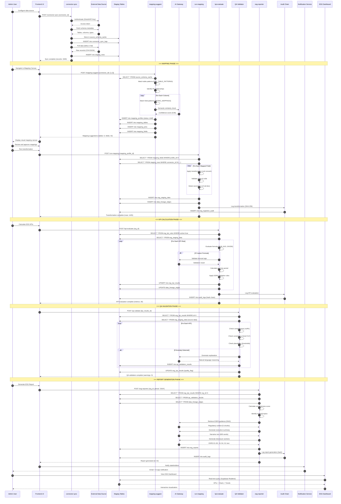
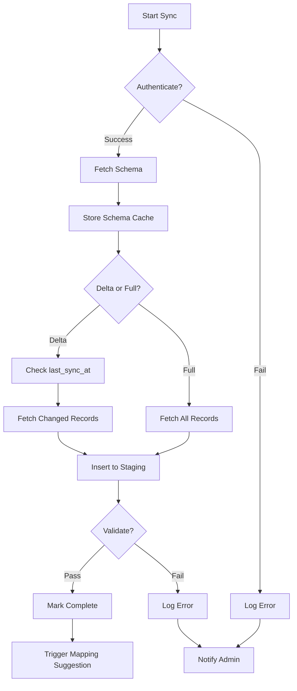
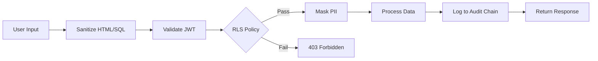

# Sequence Flow: ESG Validation & Reporting
## Complete End-to-End Process

---

## 🔄 Overview

This document details the complete sequence flow for ESG data ingestion, validation, KPI calculation, and report generation in the RegSense Compliance Copilot platform.

---

## 📊 Complete ESG Validation Flow



---

## 🧩 Detailed Phase Breakdown

### Phase 1: Data Source Configuration

**Duration:** ~5-10 minutes (manual)

**Steps:**
1. Admin navigates to Connectors page
2. Selects connector type (S3, SharePoint, SAP, etc.)
3. Provides authentication credentials (OAuth, API key)
4. Configures sync schedule (daily, weekly, manual)
5. Tests connection and verifies access

**Key Functions:**
- `connector-validate`: Test connection before saving
- `connector-sync`: Execute data pull

**Database Tables:**
- `connectors`: Store connector configuration
- `connector_sync_state`: Track last sync timestamp
- `connector_sync_logs`: Audit sync history

---

### Phase 2: Data Synchronization

**Duration:** ~2-30 minutes (depends on data volume)

**Workflow:**



**Key Validations:**
- Row count > 0
- Column types match expected schema
- No corrupt data (malformed JSON, invalid dates)
- Storage quota not exceeded

---

### Phase 3: Intelligent Mapping

**Duration:** ~30 seconds (automated)

**Algorithm:**

```typescript
// Simplified mapping suggestion logic
async function suggestMappings(connectorIds: number[]) {
  // 1. Load schema cache
  const schemas = await loadSchemaCache(connectorIds);
  
  // 2. Identify ESG-related tables
  const relevantTables = schemas.filter(table => 
    ESG_TABLE_PATTERNS.some(pattern => 
      pattern.regex.test(table.table_name)
    )
  );
  
  // 3. Suggest joins between tables
  const joins = suggestJoins(relevantTables);
  
  // 4. Map fields to metrics
  const fieldMappings = [];
  for (const table of relevantTables) {
    for (const column of table.columns) {
      if (column.data_type === 'numeric') {
        const matches = METRIC_MAPPINGS.filter(metric =>
          metric.patterns.some(pattern =>
            new RegExp(pattern, 'i').test(column.column_name) ||
            new RegExp(pattern, 'i').test(table.table_name)
          )
        );
        
        if (matches.length > 0) {
          fieldMappings.push({
            source_column: column.column_name,
            target_metric: matches[0].metric_code,
            confidence: matches[0].confidence,
            suggested_unit: matches[0].unit,
            transform: matches[0].default_transform
          });
        }
      }
    }
  }
  
  // 5. Store draft mappings
  await saveMappingProfile({
    tables: relevantTables,
    joins,
    fields: fieldMappings,
    status: 'draft'
  });
  
  return { tables, joins, fields: fieldMappings };
}
```

**Mapping Confidence Levels:**
- **High (>0.8)**: Direct name match + unit match
- **Medium (0.5-0.8)**: Semantic similarity + type match
- **Low (<0.5)**: Requires manual review

---

### Phase 4: Data Transformation & Loading

**Duration:** ~1-5 minutes (depends on volume)

**Transformation Rules:**

```typescript
// Unit conversion example
const transforms = {
  'kWh_to_MWh': (value: number) => value / 1000,
  'kg_to_tonnes': (value: number) => value / 1000,
  'USD_to_EUR': async (value: number, date: Date) => {
    const rate = await getExchangeRate('USD', 'EUR', date);
    return value * rate;
  }
};

// Aggregation example
const aggregations = {
  'SUM': (values: number[]) => values.reduce((a, b) => a + b, 0),
  'AVG': (values: number[]) => values.reduce((a, b) => a + b, 0) / values.length,
  'MAX': (values: number[]) => Math.max(...values),
  'WEIGHTED_AVG': (values: Array<{value: number, weight: number}>) => {
    const totalWeight = values.reduce((sum, v) => sum + v.weight, 0);
    return values.reduce((sum, v) => sum + v.value * v.weight, 0) / totalWeight;
  }
};
```

**Quality Checks:**
- Null percentage < 10%
- Values within expected range (3 sigma rule)
- Time series continuity (no gaps)
- Unit consistency

---

### Phase 5: KPI Calculation

**Duration:** ~10-30 seconds

**Formula Language:**

```json
{
  "metric_key": "E1-1.scope1",
  "formula": {
    "type": "field_sum",
    "source": "esg_staging_data",
    "field": "co2_emissions_kg",
    "filters": {
      "scope": "1",
      "period": "2024"
    },
    "transform": {
      "unit_conversion": "kg_to_tonnes"
    }
  },
  "validation": {
    "min": 0,
    "max": 1000000,
    "mandatory": true,
    "esrs_ref": "ESRS E1.7"
  }
}
```

**Supported Formula Types:**
- `field_sum`: Direct summation
- `weighted_average`: Weighted aggregation
- `ratio`: Division of two metrics
- `custom`: User-defined SQL

---

### Phase 6: QA Validation

**Duration:** ~20-40 seconds

**Validation Rules:**

```typescript
const qaRules = [
  {
    name: 'Completeness',
    check: (data) => (data.non_null / data.total) >= 0.9,
    severity: 'high',
    message: 'Data completeness below 90%'
  },
  {
    name: 'Consistency',
    check: (current, previous) => 
      Math.abs((current - previous) / previous) < 0.5,
    severity: 'medium',
    message: 'Year-over-year change exceeds 50%'
  },
  {
    name: 'Plausibility',
    check: (value, industry_avg) => 
      value <= industry_avg * 3,
    severity: 'medium',
    message: 'Value significantly higher than industry average'
  }
];
```

**AI-Generated Explanations:**

```typescript
async function explainAnomaly(anomaly: Anomaly) {
  const prompt = `
    Explain why this ESG metric is flagged as anomalous:
    - Metric: ${anomaly.metric}
    - Value: ${anomaly.value}
    - Expected Range: ${anomaly.expected_min} - ${anomaly.expected_max}
    - Context: ${anomaly.industry}, ${anomaly.period}
    
    Provide possible causes and recommendations.
  `;
  
  const response = await aiGateway.complete({
    model: 'google/gemini-2.5-flash',
    messages: [{ role: 'user', content: prompt }]
  });
  
  return response.choices[0].message.content;
}
```

---

### Phase 7: Report Generation

**Duration:** ~1-2 minutes

**Report Structure:**

```markdown
# ESG Report 2024

## Executive Summary
[AI-generated summary of key findings]

## Materiality Matrix
[Visual representation of material topics]

## Environmental Performance (ESRS E1-E5)

### E1: Climate Change
- **Scope 1 Emissions**: 1,234 tCO2e (-12% YoY)
- **Scope 2 Emissions**: 567 tCO2e (-8% YoY)
- **Scope 3 Emissions**: 3,456 tCO2e (data quality: medium)

[AI-generated narrative with citations]

## Social Performance (ESRS S1-S4)
[Similar structure]

## Governance (ESRS G1)
[Similar structure]

## Data Quality & Assurance
[QA validation results]

## Appendix: Data Lineage
[Complete source → calculation trail]
```

**AI Prompt for Narrative:**

```typescript
const narrativePrompt = `
Based on the following ESG data, generate a professional narrative section for an ESRS E1 (Climate Change) disclosure:

Data:
- Scope 1: 1,234 tCO2e (previous year: 1,402 tCO2e)
- Scope 2: 567 tCO2e (previous year: 617 tCO2e)
- Energy consumption: 4,567 MWh (45% renewable)
- Reduction initiatives: LED retrofit, solar panels, EV fleet

Regulatory Context:
${ragContext}

Requirements:
1. Comply with ESRS E1 structure
2. Highlight year-over-year improvements
3. Explain reduction initiatives
4. Reference relevant regulations
5. Keep to 300-400 words
6. Professional, fact-based tone
`;
```

---

## 📈 Performance Benchmarks

| Phase | Expected Duration | Max Acceptable | Actions if Exceeded |
|-------|------------------|----------------|---------------------|
| Connector Sync | 2-10 min | 30 min | Implement pagination, delta sync |
| Mapping Suggestion | 30 sec | 2 min | Optimize pattern matching, cache results |
| Data Transformation | 1-5 min | 15 min | Batch processing, parallel execution |
| KPI Calculation | 10-30 sec | 2 min | Materialize intermediate results |
| QA Validation | 20-40 sec | 2 min | Async processing, prioritize critical checks |
| Report Generation | 1-2 min | 5 min | Pre-generate templates, cache narratives |

---

## 🔐 Security Checkpoints



**Security Measures at Each Phase:**
1. **Connector Sync**: Encrypted credentials, OAuth refresh
2. **Mapping**: User cannot access other orgs' mappings (RLS)
3. **Transformation**: SQL injection prevention, parameterized queries
4. **KPI Calculation**: Read-only access to source data
5. **QA Validation**: No data modification, only flagging
6. **Report Generation**: PII masking before AI processing

---

## 🚨 Error Handling & Recovery

### Error Scenarios

| Error Type | Impact | Auto-Recovery | Manual Action |
|------------|--------|---------------|---------------|
| Connector Authentication Failed | Sync blocked | Retry with backoff (3x) | Re-authenticate, update credentials |
| Invalid Data Format | Partial sync | Skip invalid rows, log errors | Review source data, update parser |
| Mapping Confidence Low | Manual review needed | N/A | Admin reviews and approves mappings |
| KPI Formula Invalid | Calculation skipped | N/A | Fix formula syntax, re-run |
| AI Gateway Timeout | Report incomplete | Retry with simpler prompt | Use template-based narrative |
| Database Connection Lost | Transaction rolled back | Automatic reconnect | Check DB health, scale instance |

### Rollback Strategy

```typescript
async function safeTransform(mappingId: number) {
  const transaction = await db.transaction();
  
  try {
    // 1. Start transformation
    await transaction.execute('BEGIN');
    
    // 2. Process data
    const results = await applyMappings(mappingId);
    
    // 3. Validate results
    const validation = await validateResults(results);
    
    if (validation.passed) {
      await transaction.execute('COMMIT');
      return { success: true, results };
    } else {
      await transaction.execute('ROLLBACK');
      return { success: false, errors: validation.errors };
    }
  } catch (error) {
    await transaction.execute('ROLLBACK');
    throw error;
  }
}
```

---

## 📊 Monitoring & Observability

### Key Metrics to Track

```typescript
const metrics = {
  // Performance
  'connector_sync_duration_ms': 'histogram',
  'mapping_suggestion_duration_ms': 'histogram',
  'kpi_calculation_duration_ms': 'histogram',
  'report_generation_duration_ms': 'histogram',
  
  // Throughput
  'rows_synced_per_minute': 'counter',
  'kpis_calculated_per_hour': 'counter',
  'reports_generated_per_day': 'counter',
  
  // Quality
  'data_quality_score_avg': 'gauge',
  'mapping_confidence_avg': 'gauge',
  'qa_validation_pass_rate': 'gauge',
  
  // Errors
  'connector_sync_errors_total': 'counter',
  'ai_gateway_timeout_total': 'counter',
  'database_errors_total': 'counter'
};
```

### Health Check Endpoints

```typescript
// Edge function: system-health-check
export default async function healthCheck() {
  const checks = await Promise.allSettled([
    checkDatabase(),
    checkAIGateway(),
    checkStorage(),
    checkConnectors(),
    checkAgentRunner()
  ]);
  
  return {
    status: checks.every(c => c.status === 'fulfilled') ? 'healthy' : 'degraded',
    checks: checks.map((c, i) => ({
      component: ['database', 'ai_gateway', 'storage', 'connectors', 'agent_runner'][i],
      status: c.status,
      latency_ms: c.status === 'fulfilled' ? c.value.latency : null,
      error: c.status === 'rejected' ? c.reason.message : null
    }))
  };
}
```

---

## 📝 Related Documentation

- [Architecture Overview](./ARCHITECTURE_OVERVIEW.md)
- [Module Dependency Graph](./MODULE_DEPENDENCY_GRAPH.md)
- [API Contracts](./API_CONTRACTS.md)
- [Data Ingestion Map](./DATA_INGESTION_MAP.md)
